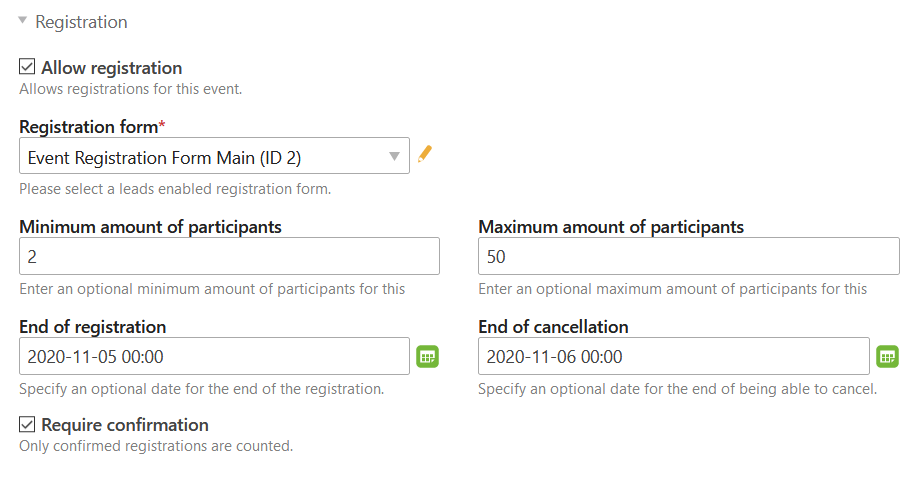
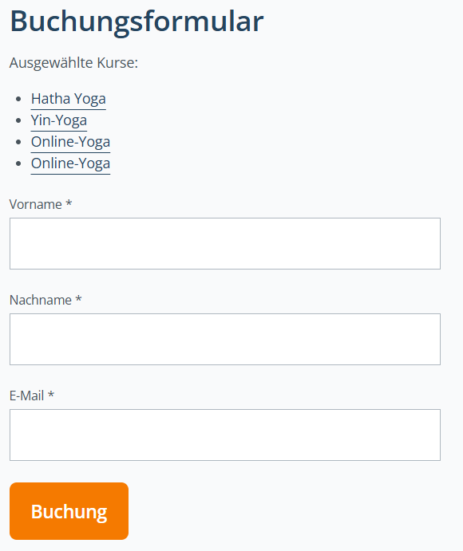

Contao Event Registration
=========================

Contao extension to allow registration for events.

After installation you will have the possibility to enable registration for individual events in the event's settings:

## Features 

<ul>
  <li>List registrations for individual events in the backend</li>
  <li>Supports the terminal42/contao-notification_center (https://github.com/terminal42/contao-notification_center)</li>
  <li>Supports terminal42/contao-changelanguage (https://github.com/terminal42/contao-changelanguage)</li>
  <li>Allows you to export registrations as CSV</li>
  <li>Supports custom number of participants</li>
  <li>Waiting list with notification</li>
</ul>

### Coming Features Starting with version 2.2.0  

<ul>
  <li>Multiple registrations: Allow visitors to register for multiple events at once.</li>
  <li>Member Registration List: This module will list all event registrations of the currently logged in front end user. It will also show links to Confirm (if applicable) or Cancel the registration.</li>
</ul>

## Documentation

   [English manual](documentation/english.md)
  
   [Deutsches Handbuch](documentation/german.md)

## Examples

| *Event calendar with yoga courses.* |
|:--:| 
|  |

| *Possibility to select multiple courses for booking.* |
|:--:| 
|  |

| *Booking form with selected courses.* |
|:--:| 
|  |